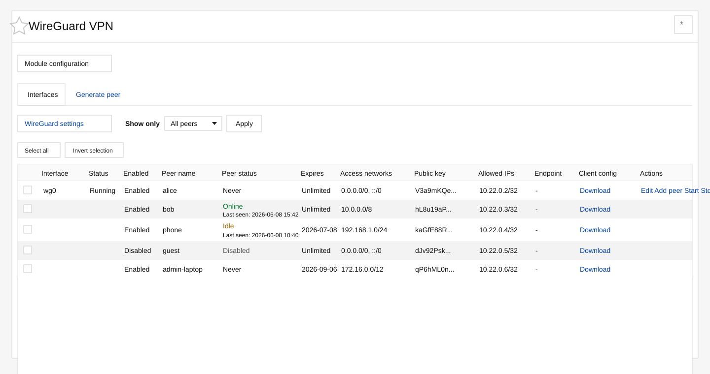

# Webmin WireGuard VPN Module

Webmin module for managing WireGuard interfaces and VPN clients from the
Webmin UI. It is built for small and medium server setups where administrators
want to generate clients, download configs, disable expired peers, and see
connection status without editing `/etc/wireguard/*.conf` by hand.



## Features

- List WireGuard interfaces from `/etc/wireguard`
- Show interface status with `wg-quick@interface`
- Show peer status from latest handshakes: online, idle, never, or disabled
- Filter peers by status: all, enabled, disabled, online, idle, or never
- Generate WireGuard client peers from Webmin
- Download generated client configuration files
- Enable, disable, or delete selected peers in bulk
- Keep disabled peer blocks in the config without activating them
- Automatically disable expired peers from cron
- Choose client access networks during generation
- Edit raw interface configuration when needed
- Configure command paths and defaults from Webmin module configuration

## Install From Webmin

In Webmin, open **Webmin -> Webmin Configuration -> Webmin Modules** and
install from this URL:

```text
https://raw.githubusercontent.com/djamic/webmin_wireguard/main/dist/wireguard_webmin.wbm.gz
```

Then open **Servers -> WireGuard VPN**.

If GitHub raw cache has not updated yet, use the latest commit-specific package
URL from the repository history.

## Install From Source

Clone the repository and run the installer as root:

```sh
git clone https://github.com/djamic/webmin_wireguard.git
cd webmin_wireguard
sudo ./install.sh
```

The installer copies the module to `/usr/share/webmin/wireguard_webmin`, writes
default module configuration under `/etc/webmin/wireguard_webmin`, installs the
expiry cron job, and adds the module to the root Webmin ACL when possible.

Restart Webmin if the module does not appear immediately:

```sh
sudo systemctl restart webmin
```

## Build Package

To build a Webmin module archive:

```sh
./build.sh
```

The output is:

```text
wireguard_webmin.wbm.gz
```

## Usage

Open **Servers -> WireGuard VPN**.

The **Interfaces** tab shows all WireGuard interface config files found in
`/etc/wireguard`. Each peer row includes the peer name, enabled state, runtime
status, expiry date, access networks, public key preview, allowed IP, endpoint,
client config download link, and interface actions.

The **Generate peer** tab creates a new client peer. You can set the peer name,
DNS servers, duration, and access networks. The module stores client config
files in `/root` by default and exposes a download link only for known peers.

## Peer Expiry

When a generated peer has a finite duration, the module writes an expiry
timestamp into the peer block:

```text
# EXPIRES 1780891200
```

The cron job in `/etc/cron.d/wireguard_webmin` runs `expire_peers.pl` every
five minutes. Expired peers are disabled, not deleted.

## Disabled Peers

Disabled peers remain in the WireGuard config, but their active peer lines are
commented and marked:

```text
# DISABLED 1
# [Peer]
# PublicKey = ...
# AllowedIPs = ...
```

This keeps history and client metadata available while preventing
`wg-quick restart` from reactivating the peer.

## Configuration

Module defaults are stored in:

```text
/etc/webmin/wireguard_webmin/config
```

Common settings:

- `wireguard_dir`: WireGuard configuration directory
- `wg_cmd`: path to the `wg` command
- `systemctl_cmd`: path to `systemctl`
- `client_config_dir`: directory for generated client configs
- `default_client_dns`: default DNS value for generated clients
- `expire_check_minutes`: expiry check interval documentation value

## Security Notes

This module manages WireGuard as root through Webmin. Only grant access to
trusted Webmin administrators.

Implemented safety checks include:

- Destructive peer actions use POST forms
- Downloaded client configs are limited to known peer names
- Peer names are sanitized before file paths are built
- WireGuard keys, DNS values, command paths, and CIDR inputs are validated
- Expired peers are disabled instead of deleted
- Disabled peer blocks are kept in the config but not loaded by `wg-quick`

## Compatibility

The module expects a Linux Webmin installation with WireGuard tools available.
It was developed and tested with Debian, Webmin 2.641, and WireGuard interfaces
managed by `wg-quick`.

## License

MIT License. See [LICENSE](LICENSE).
